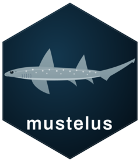

# mustelus <a href="https://alharry.github.io/mustelus/"></a>

Tools for chondrichthyan fisheries biology.

## Installation

``` r
# install.packages("pak")
pak::pak("alharry/mustelus")
```

## Functions

- `len_weight()` — length–weight regression with bias-corrected predictions,
  confidence and prediction intervals.
- `maturity()` — length or age at maturity via logistic regression, with
  bootstrap confidence intervals on $L_{50}$ and $L_{95}$.

Both return a nested tibble with one row per group and have `summary()` and
`plot()` methods. See the [articles](https://alharry.github.io/mustelus/articles/)
for worked examples.