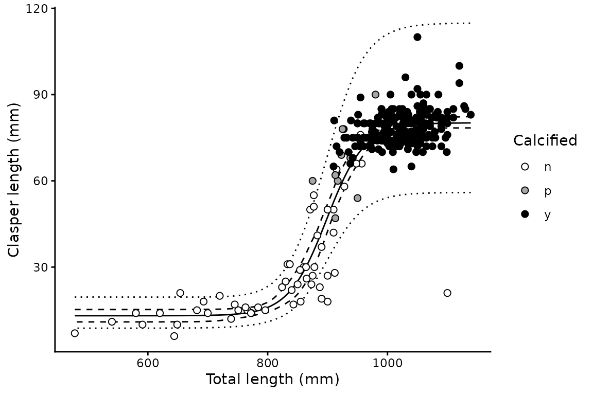
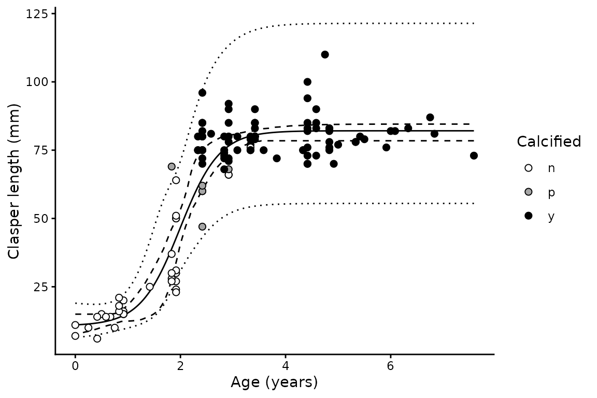

# Clasper length analysis

## Background

Male chondrichthyans undergo a rapid elongation and calcification of the
claspers as they mature. Clasper length plotted against body length or
age is therefore sigmoid: near-constant in juveniles, steeply increasing
through maturation, and asymptotic in adults.
[`clasp_length()`](https://alharry.github.io/mustelus/reference/clasp_length.md)
fits that curve:

``` math
CL = b + (a - b)\left(1 + e^{-\log(19)\,(x - L_{50})/(L_{95} - L_{50})}\right)^{-1}
```

where $`b`$ and $`a`$ are the juvenile and adult asymptotes, and
$`L_{50}`$ and $`L_{95}`$ are the values of the predictor at which
clasper length reaches 50% and 95% of the way between them. The
$`\log(19)`$ term is what makes $`L_{50}`$ and $`L_{95}`$ mean exactly
that — the same reparameterisation used by
[`maturity()`](https://alharry.github.io/mustelus/reference/maturity.md),
so the two are directly comparable.

The model is fitted on the log scale by
[`nls()`](https://rdrr.io/r/stats/nls.html). This gives multiplicative
error, matching the way variability in clasper length grows with clasper
size, and means the fitted curve describes *median* clasper length at a
given size.

## Basic usage

Females have no clasper measurement and are dropped automatically, so
the whole data frame can be passed in:

``` r

library(mustelus)
#> Welcome to mustelus package
data(spottail)

cl <- clasp_length(clasp_length, length, clasp_calc, data = spottail, times = 200)
#> The calcification variable clasp_calc has 3 levels.
summary(cl)
#> # A tibble: 1 × 15
#>       a a_lower a_upper     b b_lower b_upper   L50 L50_lower L50_upper   L95
#>   <dbl>   <dbl>   <dbl> <dbl>   <dbl>   <dbl> <dbl>     <dbl>     <dbl> <dbl>
#> 1  80.2    78.4    82.5  13.1    10.9    15.2  898.      888.      909.  992.
#> # ℹ 5 more variables: L95_lower <dbl>, L95_upper <dbl>, Sigma <dbl>, n <int>,
#> #   x.range <chr>
```

Claspers are around 13 mm in juveniles and asymptote near 80 mm in
adults, with the transition centred on 898 mm.

## Plotting

``` r

plot(cl) + xlab("Total length (mm)") + ylab("Clasper length (mm)")
```



The solid line is the fitted median, the dashed ribbon the 95%
confidence interval and the dotted ribbon the 95% prediction interval.
Both are obtained by bootstrap: the confidence interval from the
percentiles of the resampled curves, and the prediction interval by
combining that bootstrap variance with the residual variance of the fit.

Passing the optional calcification variable shades the points by stage —
white for uncalcified, grey for partially calcified and black for fully
calcified. This is a useful check on the fitted curve, since the three
stages should separate along it: uncalcified animals on the lower
asymptote, partially calcified animals through the steep transition, and
calcified animals on the upper asymptote. Calcification is used only for
plotting and does not enter the model.

## Using age as the predictor

``` r

cl_age <- clasp_length(clasp_length, age_agree, clasp_calc, data = spottail, times = 200)
#> The calcification variable clasp_calc has 3 levels.
#> 1 of 200 bootstrap replicates failed to converge and were dropped.
summary(cl_age)
#> # A tibble: 1 × 15
#>       a a_lower a_upper     b b_lower b_upper   L50 L50_lower L50_upper   L95
#>   <dbl>   <dbl>   <dbl> <dbl>   <dbl>   <dbl> <dbl>     <dbl>     <dbl> <dbl>
#> 1  82.1    78.4    84.5  10.7    5.31    15.0  1.99      1.81      2.10  3.09
#> # ℹ 5 more variables: L95_lower <dbl>, L95_upper <dbl>, Sigma <dbl>, n <int>,
#> #   x.range <chr>
```

``` r

plot(cl_age) + xlab("Age (years)") + ylab("Clasper length (mm)")
```



## Starting values

[`nls()`](https://rdrr.io/r/stats/nls.html) needs starting values, and
[`clasp_length()`](https://alharry.github.io/mustelus/reference/clasp_length.md)
derives them from the data: the asymptotes from the mean clasper length
of the smallest and largest 20% of animals, and $`L_{50}`$ and
$`L_{95}`$ by interpolating binned means. Fitting uses the `"port"`
algorithm with both asymptotes constrained positive, since a negative
asymptote would make the log-scale model undefined.

If a fit fails to converge, supply starting values directly:

``` r

clasp_length(clasp_length, length,
  data = spottail, times = 50,
  start = list(a = 80, b = 13, L50 = 900, L95 = 990)
) |> summary()
#> # A tibble: 1 × 15
#>       a a_lower a_upper     b b_lower b_upper   L50 L50_lower L50_upper   L95
#>   <dbl>   <dbl>   <dbl> <dbl>   <dbl>   <dbl> <dbl>     <dbl>     <dbl> <dbl>
#> 1  80.2    78.1    81.7  13.1    10.7    15.4  898.      889.      909.  992.
#> # ℹ 5 more variables: L95_lower <dbl>, L95_upper <dbl>, Sigma <dbl>, n <int>,
#> #   x.range <chr>
```

## Comparison with maturity

Because both functions report $`L_{50}`$ on the same scale, clasper
elongation can be compared directly with the onset of maturity:

``` r

mat <- maturity(maturity_stage, length, data = spottail[spottail$sex == "m", ],
                times = 200)

data.frame(
  quantity = c("Clasper elongation", "Maturity"),
  L50      = c(summary(cl)$L50, summary(mat)$L50),
  L95      = c(summary(cl)$L95, summary(mat)$L95)
)
#>             quantity   L50   L95
#> 1 Clasper elongation 898.5 992.1
#> 2           Maturity 929.2 982.7
```

## Output structure

The result is a one row tibble with list columns, including the
bootstrap parameter estimates:

``` r

# Fitted nls object
cl$mods[[1]]
#> Nonlinear regression model
#>   model: log(clasp) ~ log(clasp_curve(x, a, b, L50, L95))
#>    data: d
#>      a      b    L50    L95 
#>  80.18  13.09 898.50 992.12 
#>  residual sum-of-squares: 9.914
#> 
#> Algorithm "port", convergence message: relative convergence (4)
```

``` r

# Bootstrap parameter estimates, one row per replicate
head(cl$boot_coefs[[1]])
#>          a        b      L50      L95
#> 1 77.78618 16.16583 901.0248 961.9591
#> 2 77.84202 14.24222 888.3088 966.5087
#> 3 80.53822 14.65627 907.4333 981.8426
#> 4 81.25401 14.17027 900.9768 995.3944
#> 5 81.47458 12.87377 897.5844 996.8090
#> 6 80.93300 12.99348 900.6766 992.2189
```
