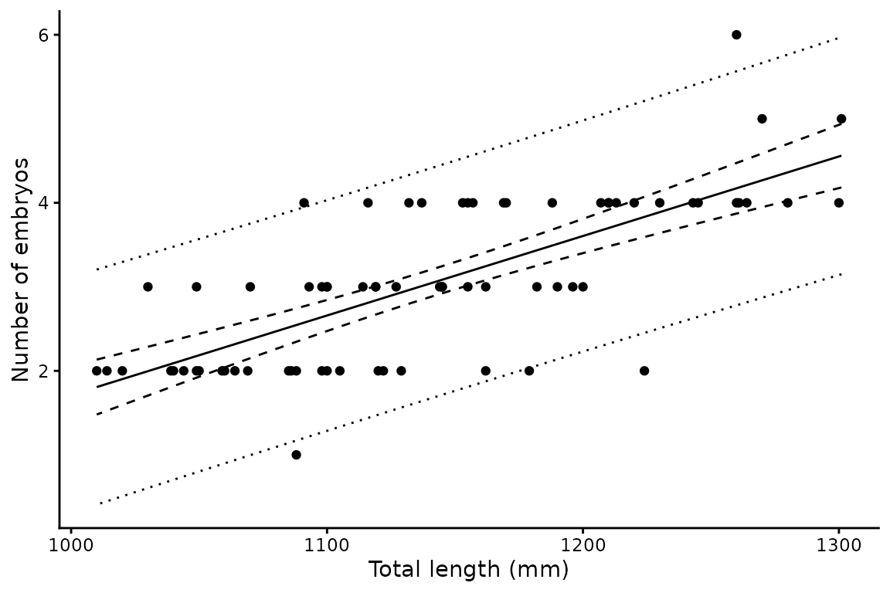
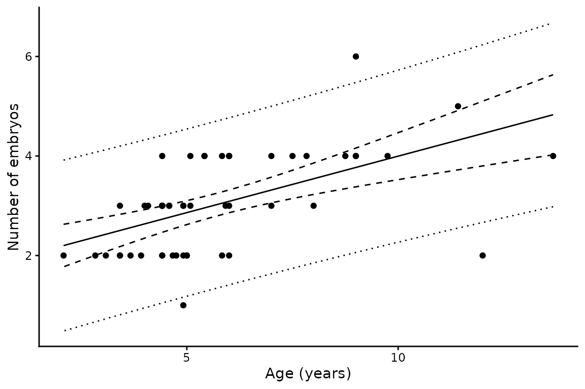
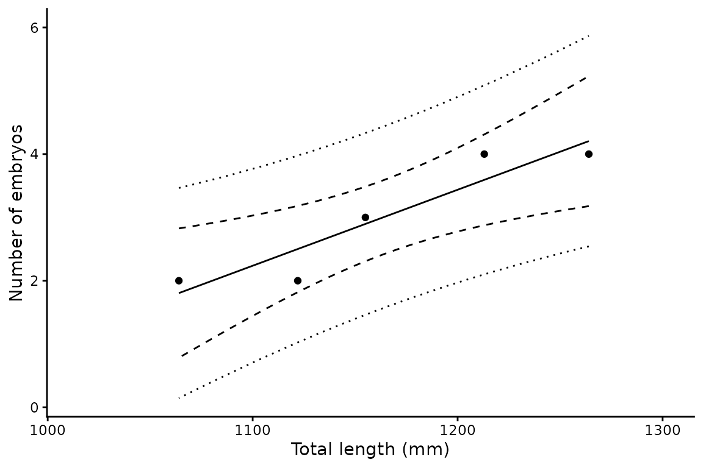

# Fecundity analysis

## Background

Fecundity in chondrichthyans — the number of *in utero* embryos carried
by a gravid female — typically increases with maternal body size.
[`fecundity()`](https://alharry.github.io/mustelus/reference/fecundity.md)
fits the simplest description of that relationship, an ordinary linear
regression:

``` math
F_i = a + b \cdot L_i + \epsilon, \quad \epsilon \sim N(0, \sigma^2)
```

where $`F_i`$ is the number of embryos carried by female $`i`$ and
$`L_i`$ is her length (or age). The slope $`b`$ is the increase in
litter size per unit length, and is usually the quantity of interest.

## Non-gravid animals are excluded

A fecundity count of zero means an animal was not gravid, not that its
fecundity was zero. Including such records would bias the intercept
downwards and inflate the slope.
[`fecundity()`](https://alharry.github.io/mustelus/reference/fecundity.md)
therefore drops records with zero or negative counts before fitting and
reports how many were removed. Predictions span the length or age range
of gravid animals only.

## Basic usage

``` r

library(mustelus)
#> Welcome to mustelus package
data(spottail)

fec <- fecundity(emb, length, data = spottail)
summary(fec)
#> # A tibble: 1 × 11
#>       a a.Std.Error       b b.Std.Error r.squared  p.value Sigma     n mean.fec
#>   <dbl> <chr>         <dbl> <chr>           <dbl>    <dbl> <dbl> <int>    <dbl>
#> 1 -7.75 ( 1.24 )    0.00946 ( 0.00108 )     0.527 7.97e-13 0.682    71     3.06
#> # ℹ 2 more variables: fec.range <chr>, x.range <chr>
```

The summary reports the intercept $`a`$ and slope $`b`$ with their
standard errors, the coefficient of determination, the p-value for the
slope, the residual standard deviation $`\sigma`$, sample size, mean and
range of observed fecundity, and the predictor range over which the
model applies.

## Plotting

[`plot()`](https://rdrr.io/r/graphics/plot.default.html) returns a named
list of ggplot objects, one per group. The solid line is the fitted
mean, the dashed ribbon the 95% confidence interval, and the dotted
ribbon the 95% prediction interval — the presentation used by Walker
(2005).

``` r

p <- plot(fec)
p$Unspecified + xlab("Total length (mm)") + ylab("Number of embryos")
```



As in
[`len_weight()`](https://alharry.github.io/mustelus/reference/len_weight.md),
the two interval types answer different questions. The confidence
interval describes uncertainty in *mean* litter size at a given length
and narrows as data accumulate; the prediction interval describes the
spread of litter sizes you would expect to observe in *individual*
females, and does not narrow appreciably. For predicting the
reproductive output of a female of known size, the prediction interval
is the relevant one.

## Using age as the predictor

Any continuous predictor works — here maternal age rather than length:

``` r

fec_age <- fecundity(emb, age_agree, data = spottail)
summary(fec_age)
#> # A tibble: 1 × 11
#>       a a.Std.Error     b b.Std.Error r.squared  p.value Sigma     n mean.fec
#>   <dbl> <chr>       <dbl> <chr>           <dbl>    <dbl> <dbl> <int>    <dbl>
#> 1  1.73 ( 0.303 )   0.227 ( 0.0487 )      0.299 0.000023 0.829    53     3.04
#> # ℹ 2 more variables: fec.range <chr>, x.range <chr>
```

``` r

plot(fec_age)$Unspecified + xlab("Age (years)") + ylab("Number of embryos")
```



## Grouping

Passing a grouping variable fits a separate model per group and adds a
pooled `"all"` group. Groups with fewer than three gravid females cannot
support a regression with intervals and are dropped with a warning.

``` r

fec_yr <- fecundity(emb, length, year, data = spottail)
#> The categorical variable year has 6 levels.
#> Warning in fecundity(emb, length, year, data = spottail): Group(s) with fewer
#> than 3 observations were dropped: 2007
summary(fec_yr)
#> # A tibble: 4 × 11
#>        a a.Std.Error       b b.Std.Error r.squared  p.value Sigma     n mean.fec
#>    <dbl> <chr>         <dbl> <chr>           <dbl>    <dbl> <dbl> <int>    <dbl>
#> 1  -7.79 ( 1.28 )    0.00949 ( 0.00111 )     0.52  2.71e-12 0.686    69     3.06
#> 2  -7.82 ( 2.34 )    0.00944 ( 0.002 )       0.451 6.64e- 5 0.738    29     3.21
#> 3  -8.34 ( 1.78 )    0.0101  ( 0.00159 )     0.549 3.57e- 7 0.680    35     2.94
#> 4 -11.0  ( 3.08 )    0.012   ( 0.00264 )     0.873 2   e- 2 0.411     5     3   
#> # ℹ 2 more variables: fec.range <chr>, x.range <chr>
```

``` r

plot(fec_yr)$`2009` + xlab("Total length (mm)") + ylab("Number of embryos")
```



## Output structure

The result is a nested tibble with one row per group and named list
columns:

``` r

# Fitted lm object for the pooled group
fec_yr$mods[["all"]]
#> 
#> Call:
#> lm(formula = fec ~ x, data = data)
#> 
#> Coefficients:
#> (Intercept)            x  
#>   -7.790308     0.009486
```

``` r

# Predicted values
head(fec_yr$preds[["all"]])
#>          x      fec   clower   cupper    plower   pupper
#> 1 1014.000 1.828990 1.497392 2.160587 0.4198767 3.238103
#> 2 1015.442 1.842671 1.513849 2.171494 0.4342086 3.251134
#> 3 1016.884 1.856353 1.530297 2.182408 0.4485336 3.264172
#> 4 1018.327 1.870034 1.546738 2.193331 0.4628516 3.277217
#> 5 1019.769 1.883716 1.563170 2.204261 0.4771626 3.290269
#> 6 1021.211 1.897397 1.579594 2.215200 0.4914665 3.303328
```

The `preds` data frame contains six columns: `x`, `fec` (predicted
mean), `clower`/`cupper` (95% confidence interval), and
`plower`/`pupper` (95% prediction interval).

## Reference

Walker, T.I. (2005) Reproduction in fisheries science. In: Hamlett, W.C.
(ed) *Reproductive Biology and Phylogeny of Chondrichthyes*.
