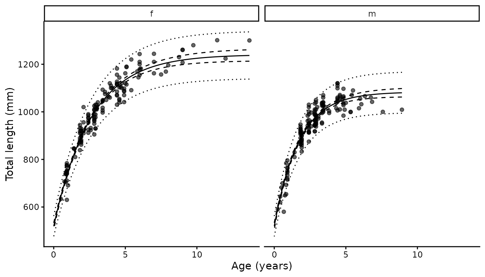

# Growth analysis

## Background

Growth is usually described with a von Bertalanffy function, and usually
parameterised by $`L_\infty`$, $`K`$ and $`t_0`$. The third parameter is
the hypothetical age at zero length, which has no biological meaning and
is often estimated at implausible values when there are few young
animals in the sample.
[`growth()`](https://alharry.github.io/mustelus/reference/growth.md)
uses the reparameterisation of Harry et al. (2019), replacing $`t_0`$
with length at birth:

``` math
L_{i,g}(a) = L_0 + (L_{\infty,g} - L_0)\left(1 - e^{-K_g a_{i,g}}\right)
```

$`L_0`$ is interpretable, can be measured directly, and anchors the
curve at the left-hand end where age data are usually weakest.
$`L_\infty`$ and $`K`$ are estimated separately for each group,
typically sex, while $`L_0`$ is shared.

Observed length is normally distributed about the curve with a standard
deviation proportional to expected length, $`\sigma_L = CV_L L_{i,g}`$,
following Cope and Punt (2007). Individual variability in length at age
therefore grows with size, which is what length at age data normally
look like.

Two further components from Harry et al. (2019) are optional, and can be
used independently.

### Ageing error

Ages read from vertebrae are estimates, not measurements. Treating them
as exact biases growth estimates: the usual consequence is that $`K`$
comes out too high and $`L_\infty`$ too low, because reading error
flattens the apparent relationship at the top end. The model treats true
age as a random effect, with each reading an observation of it:

``` math
A_{i,j} = a_i + \epsilon_{a,ij}, \qquad \epsilon_{a,ij} \sim N(0, (CV_a a_i)^2)
```

The ageing CV is computed outside the likelihood from replicate
readings, following Chang (1982), and held fixed.

### Neonates

Animals with an unhealed umbilical scar are known to be age zero. Their
lengths are direct information on $`L_0`$:

``` math
L_{0,i} \sim N(L_0, (CV_L L_{0,i})^2)
```

These are often available in numbers, and from animals that were never
aged, so they add information at no cost.

Fitting is by maximum likelihood with `RTMB`, the random effects
integrated out by the Laplace approximation. Confidence intervals on the
curve come from the delta method; prediction intervals add $`CV_L`$.

This is a port of the `TMB` implementation used in Harry et al. (2019),
and reproduces the published estimates for *Carcharhinus limbatus* to
within rounding: $`L_{\infty}`$ 263.3 and 241.9 cm, $`K`$ 0.1418 and
0.1565, $`L_0`$ 72.77 cm and $`CV_L`$ 0.0487.

## Basic usage

``` r

library(mustelus)
data(spottail)

g <- growth(length, age_agree, sex, data = spottail,
            neonate = umb_scar %in% c("y", "p"))
summary(g)
#> # A tibble: 2 × 17
#>   group  Linf Linf_lower Linf_upper     K K_lower K_upper    L0 L0_lower
#>   <chr> <dbl>      <dbl>      <dbl> <dbl>   <dbl>   <dbl> <dbl>    <dbl>
#> 1 f      1241       1215       1266 0.383   0.350   0.415  519.     505.
#> 2 m      1083       1064       1103 0.580   0.526   0.633  519.     505.
#> # ℹ 8 more variables: L0_upper <dbl>, CV_L <dbl>, n <int>, n0 <int>,
#> #   cv_age <dbl>, nll <dbl>, AIC <dbl>, convergence <lgl>
```

The summary has one row per group. $`L_\infty`$ and $`K`$ differ between
them; $`L_0`$ and $`CV_L`$ are shared and so repeat. Also reported are
the number of aged animals per group (`n`), the number of neonates
(`n0`), the ageing CV if used, the negative log-likelihood, AIC, and
whether the fit converged with a positive-definite Hessian.

Female spot-tail sharks reach a larger asymptotic length than males
(1241 against 1083 mm) and grow more slowly toward it (0.38 against
0.58). That pattern, females larger and slower, is common in
carcharhinids.

## Plotting

``` r

plot(g) + xlab("Age (years)") + ylab("Total length (mm)")
```



The solid line is the fitted curve, the dashed ribbon the 95% confidence
interval on it, and the dotted ribbon the 95% prediction interval for
individual animals. The prediction interval widens with size, which is
the $`CV_L`$ assumption at work.

## Length at birth

Supplying `neonate` flags animals of known age zero. Any flagged animal
that also carries an age is used only for the length at birth term, not
as length at age data: an age-zero observation and a length at birth
observation say exactly the same thing, so counting both would double
the weight. The function reports how many were moved.

``` r

g$neonates[[1]]
#> [1] 478 550 545 540 505
```

Here all five neonates were also aged, at exactly age zero, so the two
formulations are mathematically identical and removing them changes
nothing. Where neonates come from separate sampling, as in Harry et al.
(2019), they add genuinely new information, and are frequently the only
data available for the smallest sizes.

## Ageing error

Where replicate readings exist, pass the columns to `reads` and the
ageing CV is computed from them. `spottail` carries only a consensus
age, so for illustration here are two simulated readings around it:

``` r

library(dplyr)

sp <- spottail |>
  mutate(reader1 = pmax(0, round(age_agree + rnorm(n(), 0, 0.3), 2)),
         reader2 = pmax(0, round(age_agree + rnorm(n(), 0, 0.3), 2)))

g_reads <- growth(length, age_agree, sex, data = sp,
                  neonate = umb_scar %in% c("y", "p"),
                  reads = c(reader1, reader2))
summary(g_reads)[, c("group", "Linf", "K", "L0", "cv_age")]
#> # A tibble: 2 × 5
#>   group  Linf     K    L0 cv_age
#>   <chr> <dbl> <dbl> <dbl>  <dbl>
#> 1 f      1241 0.373  525.  0.182
#> 2 m      1078 0.590  525.  0.182
```

If only a consensus age is available but the ageing CV is known from
elsewhere, supply it directly with `cv_age`. This is the more common
situation when reanalysing published data.

``` r

sapply(c(0, 0.05, 0.10, 0.20), function(cv) {
  gg <- if (cv == 0) {
    growth(length, age_agree, sex, data = spottail,
           neonate = umb_scar %in% c("y", "p"))
  } else {
    growth(length, age_agree, sex, data = spottail,
           neonate = umb_scar %in% c("y", "p"), cv_age = cv)
  }
  c(cv_age = cv, Linf_f = summary(gg)$Linf[1], K_f = summary(gg)$K[1])
}) |> t() |> as.data.frame()
#>   cv_age Linf_f    K_f
#> 1   0.00   1241 0.3829
#> 2   0.05   1242 0.3806
#> 3   0.10   1246 0.3738
#> 4   0.20   1249 0.3628
```

As the assumed ageing error grows, $`L_\infty`$ rises and $`K`$ falls.
That is the expected direction: ignoring ageing error makes growth look
faster and the asymptote smaller than it is. The size of the shift
depends on how much error there is, which is why estimating $`CV_a`$
from replicate readings is worth doing where the readings exist.

With neither `reads` nor `cv_age`, age is treated as measured without
error and the model reduces to an ordinary von Bertalanffy fit.

## Output structure

``` r

# Fixed-effect estimates and standard errors
summary(g$mods[[1]]$sdreport, "fixed")
#>          Estimate   Std. Error
#> Linf 1.240716e+03 13.098814452
#> Linf 1.083294e+03  9.814274998
#> K    3.829032e-01  0.016599074
#> K    5.796683e-01  0.027395151
#> L0   5.191611e+02  7.280696262
#> CV_L 3.970768e-02  0.001629402
```

``` r

head(g$preds[[1]])
#>   group       age      len    lower    upper   plower   pupper
#> 1     f 0.0000000 519.1611 504.8909 533.4312 476.3104 562.0118
#> 2     f 0.1380505 556.3119 543.9794 568.6445 511.2936 601.3302
#> 3     f 0.2761010 591.5500 580.7770 602.3229 544.2677 638.8322
#> 4     f 0.4141515 624.9737 615.3955 634.5519 575.3997 674.5477
#> 5     f 0.5522020 656.6765 647.9518 665.4012 604.8300 708.5231
#> 6     f 0.6902525 686.7471 678.5738 694.9204 632.6783 740.8159
```

`mods` holds the `RTMB` objective function, the `nlminb` result and the
`sdreport`. Note that the objective is an external pointer and will not
survive [`saveRDS()`](https://rdrr.io/r/base/readRDS.html); the rest of
the object is ordinary R data.

## References

Chang, W.Y.B. (1982) A statistical method for evaluating the
reproducibility of age determination. *Canadian Journal of Fisheries and
Aquatic Sciences* **39**(8), 1208–1210.
[doi:10.1139/f82-158](https://doi.org/10.1139/f82-158)

Cope, J.M. and Punt, A.E. (2007) Admitting ageing error when fitting
growth curves: an example using the von Bertalanffy growth function with
random effects. *Canadian Journal of Fisheries and Aquatic Sciences*
**64**(2), 205–218.
[doi:10.1139/f06-179](https://doi.org/10.1139/f06-179)

Harry, A.V., Butcher, P.A., Macbeth, W.G., Morgan, J.A.T., Taylor, S.M.
and Geraghty, P.T. (2019) Life history of the common blacktip shark,
*Carcharhinus limbatus*, from central eastern Australia and comparative
demography of a cryptic shark complex. *Marine and Freshwater Research*
**70**(6), 834–848.
[doi:10.1071/MF18141](https://doi.org/10.1071/MF18141)
