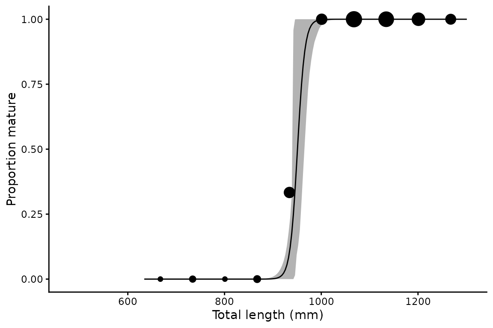
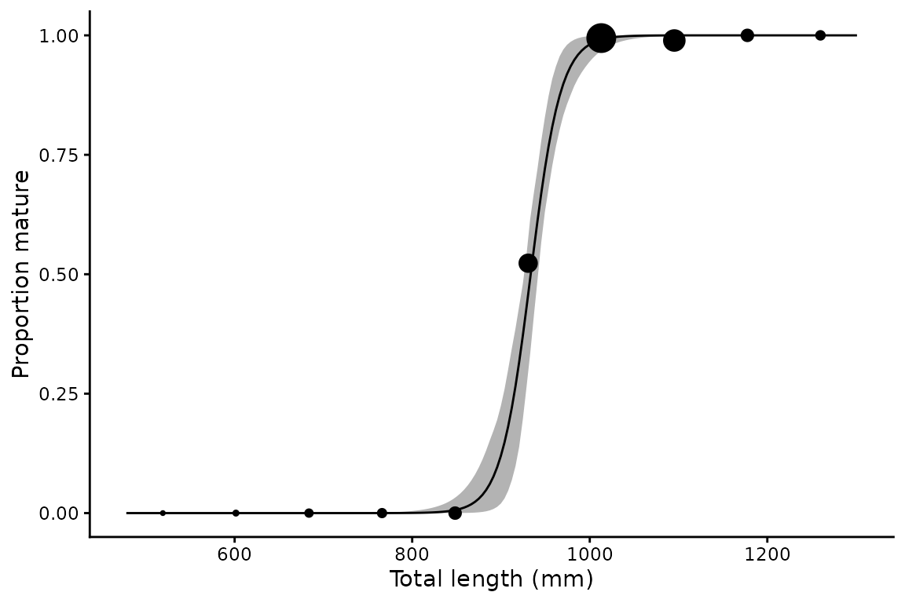
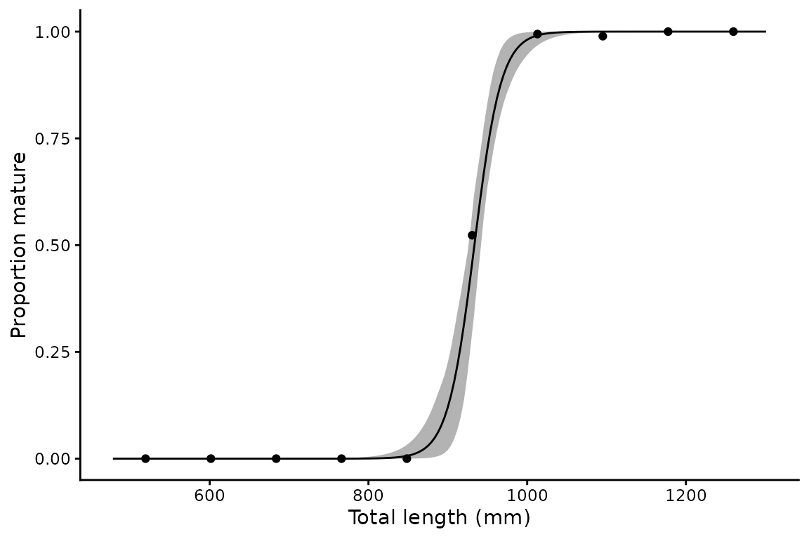
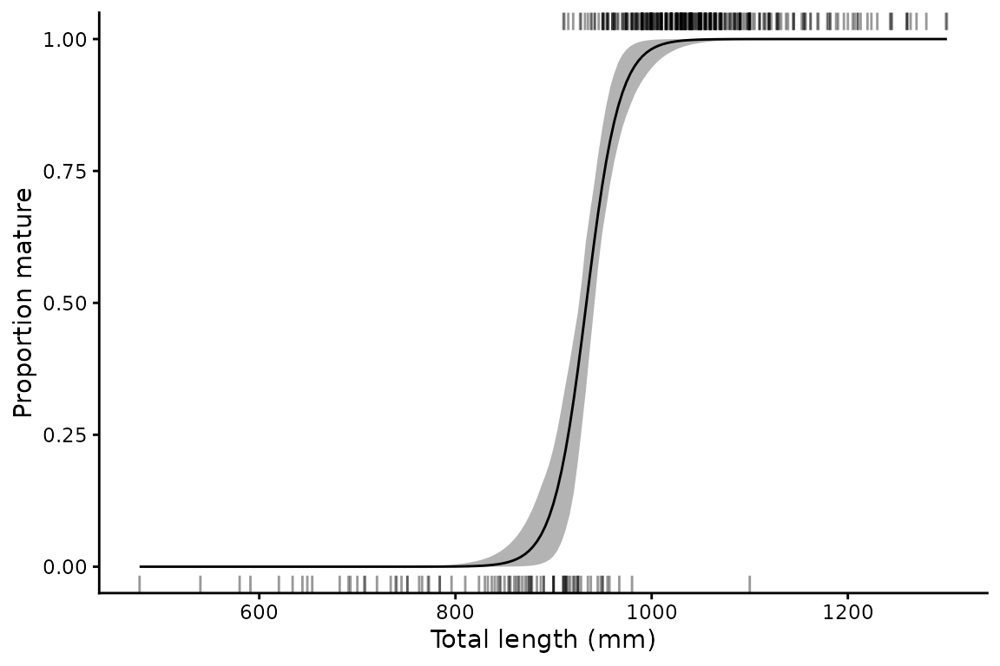
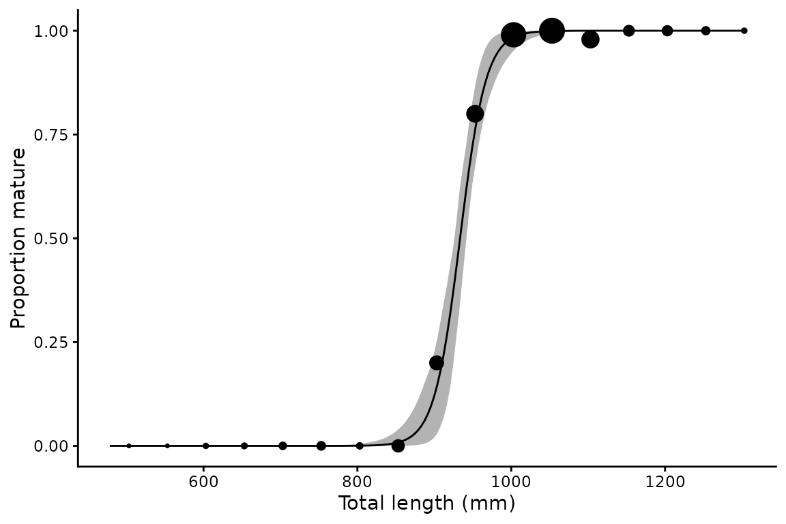
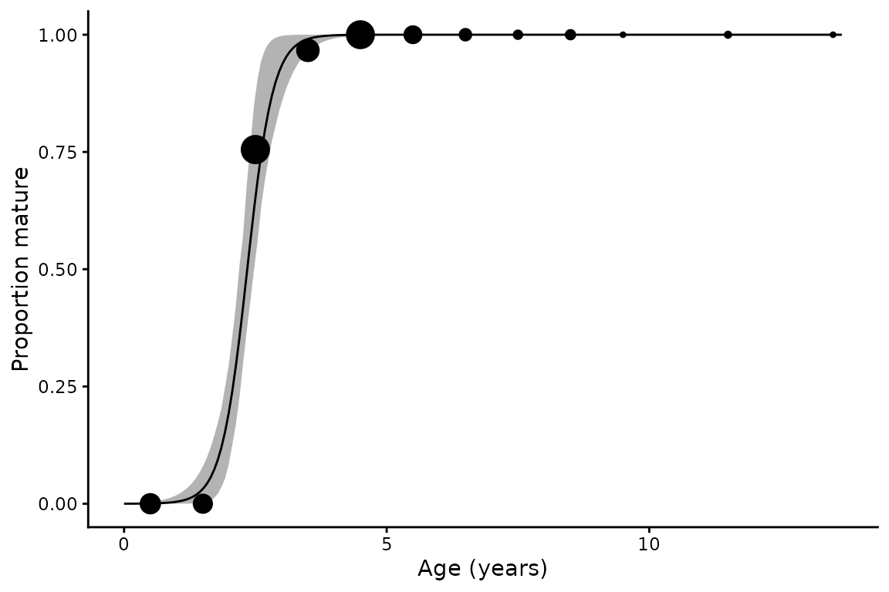

# Length at maturity analysis

The
[`maturity()`](https://alharry.github.io/mustelus/reference/maturity.md)
function fits a logistic regression of binary maturity (0 = immature, 1
= mature) as a function of a continuous predictor such as length or age:

``` math
P(\text{mature}) = \frac{1}{1 + e^{-(a + b \cdot L)}}
```

Key outputs are $`L_{50}`$ and $`L_{95}`$ — the lengths (or ages) at
which 50% and 95% of individuals are expected to be mature — with
bootstrap confidence intervals.

## Basic usage

``` r

library(mustelus)
#> Welcome to mustelus package
data(spottail)

lm50 <- maturity(maturity_stage, length, data = spottail, times = 200)
#> Warning: There was 1 warning in `mutate()`.
#> ℹ In argument: `L95_b = map_dbl(mod_b, ~(log(0.95/0.05) -
#>   coef(.x)[[1]])/coef(.x)[[2]])`.
#> ℹ In group 0: .
#> Caused by warning:
#> ! There were 63 warnings in `mutate()`.
#> The first warning was:
#> ℹ In argument: `mod_b = map(splits, ~glm(mat ~ x, family = binomial, data =
#>   rsample::analysis(.x)))`.
#> Caused by warning:
#> ! glm.fit: fitted probabilities numerically 0 or 1 occurred
#> ℹ Run `dplyr::last_dplyr_warnings()` to see the 62 remaining warnings.
summary(lm50)
#> # A tibble: 1 × 10
#>       a      b   L50 L50_lower L50_upper   L95 L95_lower L95_upper     n     N
#>   <dbl>  <dbl> <dbl>     <dbl>     <dbl> <dbl>     <dbl>     <dbl> <int> <int>
#> 1 -55.4 0.0594  934.      926.      942.  983.      965.      1002   430   341
```

## Grouping by sex

``` r

lm50_sex <- maturity(maturity_stage, length, sex, data = spottail, times = 200)
#> The categorical variable sex has 2 levels.
#> Warning: There were 4 warnings in `mutate()`.
#> The first warning was:
#> ℹ In argument: `L95_b = map_dbl(mod_b, ~(log(0.95/0.05) -
#>   coef(.x)[[1]])/coef(.x)[[2]])`.
#> ℹ In group 0: .
#> Caused by warning:
#> ! There were 67 warnings in `mutate()`.
#> The first warning was:
#> ℹ In argument: `mod_b = map(splits, ~glm(mat ~ x, family = binomial, data =
#>   rsample::analysis(.x)))`.
#> Caused by warning:
#> ! glm.fit: fitted probabilities numerically 0 or 1 occurred
#> ℹ Run `dplyr::last_dplyr_warnings()` to see the 66 remaining warnings.
#> ℹ Run `dplyr::last_dplyr_warnings()` to see the 3 remaining warnings.
summary(lm50_sex)
#> # A tibble: 3 × 10
#>        a      b   L50 L50_lower L50_upper   L95 L95_lower L95_upper     n     N
#>    <dbl>  <dbl> <dbl>     <dbl>     <dbl> <dbl>     <dbl>     <dbl> <int> <int>
#> 1  -55.4 0.0594  934.      926.      942.  983.      963.      998.   430   341
#> 2 -124.  0.131   951.      940.      965.  973.      942.      993.   118    97
#> 3  -51.1 0.0550  929.      920.      940.  983.      963.     1002    312   244
```

## Plotting

[`plot()`](https://rdrr.io/r/graphics/plot.default.html) returns a named
list of ggplot objects. The default shows binned observed proportions
scaled by sample size.

``` r

p <- plot(lm50_sex)
p$f + xlab("Total length (mm)") + ylab("Proportion mature")
```



### Plot styles

Three styles for raw data display are available:

``` r

# Proportions (default) — point size scaled by n per bin
plot(lm50, raw_data = "proportions")$Unspecified +
  xlab("Total length (mm)") + ylab("Proportion mature")
```



``` r

# Point — same bins, uniform point size
plot(lm50, raw_data = "point")$Unspecified +
  xlab("Total length (mm)") + ylab("Proportion mature")
```



``` r

# Rug — mature individuals on top, immature on bottom
plot(lm50, raw_data = "rug")$Unspecified +
  xlab("Total length (mm)") + ylab("Proportion mature")
```



### Adjusting bin width

The `binwidth` argument controls the width of bins in data units
(default is range/10):

``` r

plot(lm50, binwidth = 50)$Unspecified +
  xlab("Total length (mm)") + ylab("Proportion mature")
```



## Using age as the predictor

[`maturity()`](https://alharry.github.io/mustelus/reference/maturity.md)
works with any continuous predictor — here using age rather than length:

``` r

am50 <- maturity(maturity_stage, age_agree, data = spottail, times = 200)
#> Warning: There were 2 warnings in `mutate()`.
#> The first warning was:
#> ℹ In argument: `.fit = map(data, ~maturity_mod(.x))`.
#> ℹ In group 1: `grouping_var = Unspecified`.
#> Caused by warning:
#> ! glm.fit: fitted probabilities numerically 0 or 1 occurred
#> ℹ Run `dplyr::last_dplyr_warnings()` to see the 1 remaining warning.
summary(am50)
#> # A tibble: 1 × 10
#>       a     b   L50 L50_lower L50_upper   L95 L95_lower L95_upper     n     N
#>   <dbl> <dbl> <dbl>     <dbl>     <dbl> <dbl>     <dbl>     <dbl> <int> <int>
#> 1 -9.50  4.05  2.35      2.19      2.48  3.07      2.62      3.38   211   153
```

``` r

plot(am50, binwidth = 1)$Unspecified +
  xlab("Age (years)") + ylab("Proportion mature")
```



## Output structure

Like
[`len_weight()`](https://alharry.github.io/mustelus/reference/len_weight.md),
the result is a nested tibble with named list columns per group:

``` r

# Bootstrap L50 estimates for all individuals
quantile(lm50_sex$mods[["f"]]$fitted.values)
#>           0%          25%          50%          75%         100% 
#> 2.220446e-16 9.986775e-01 1.000000e+00 1.000000e+00 1.000000e+00

# Predicted maturity curve for females
head(lm50_sex$preds[["f"]])
#>          x          mat        lower        upper
#> 1 634.0000 2.220446e-16 2.220446e-16 5.346166e-13
#> 2 637.3518 2.220446e-16 2.220446e-16 7.193201e-13
#> 3 640.7035 2.220446e-16 2.220446e-16 9.678395e-13
#> 4 644.0553 2.220446e-16 2.220446e-16 1.302224e-12
#> 5 647.4070 2.220446e-16 2.220446e-16 1.752143e-12
#> 6 650.7588 2.220446e-16 2.220446e-16 2.357515e-12
```
