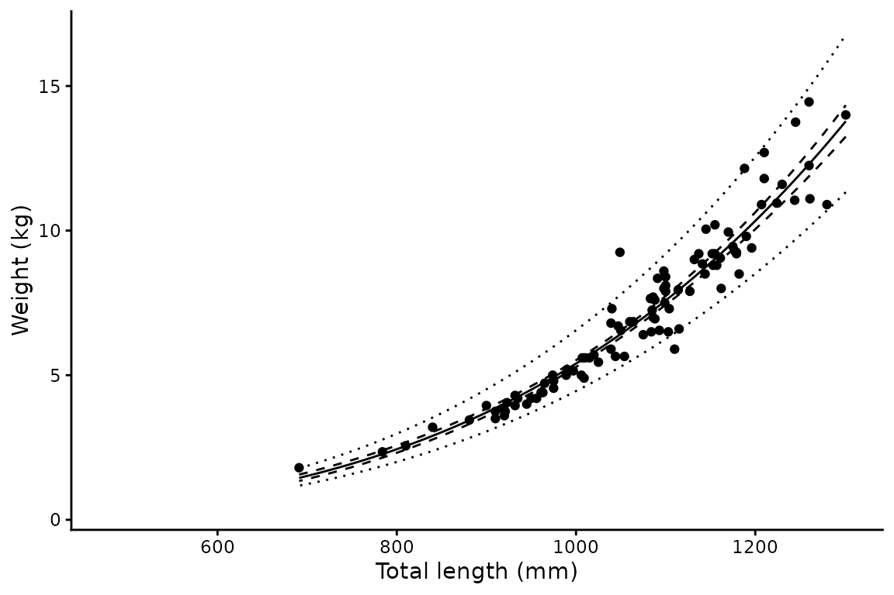
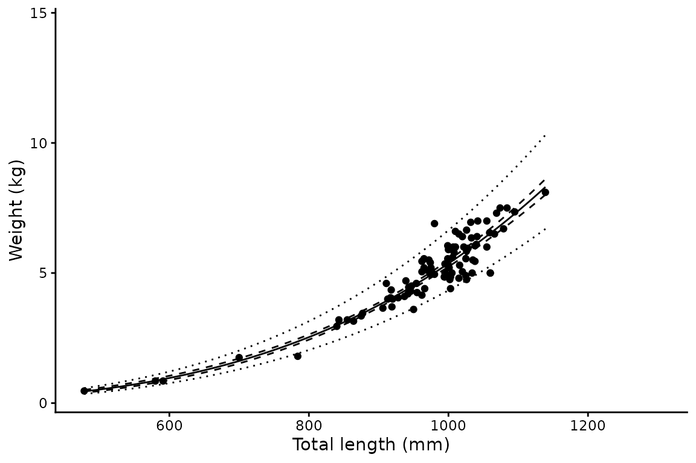

# Length-weight analysis

## Background

The relationship between body mass and length in fishes is typically
described by a power curve:

``` math
W_i = \alpha L_i^{\beta}
```

where $`W_i`$ and $`L_i`$ are the weight and length of individual $`i`$,
and $`\alpha`$ and $`\beta`$ are estimated parameters. Individual
variability in weight also increases with length, so a multiplicative
rather than additive error structure is more appropriate:

``` math
W_i = \alpha L_i^{\beta} e^{\epsilon}, \quad \epsilon \sim N(0, \sigma^2)
```

Upon log-transformation this becomes a standard linear regression:

``` math
\ln(W_i) = \ln(\alpha) + \beta \cdot \ln(L_i) + \epsilon
```

where $`\ln(\alpha)`$ is the intercept and $`\beta`$ is the slope. This
is the model fitted by
[`len_weight()`](https://alharry.github.io/mustelus/reference/len_weight.md).

## Bias correction

A subtle but important consequence of log-transforming the response is
that back-transforming predictions gives the *median* weight at a given
length, not the mean. For a lognormal distribution, the mean is:

``` math
E[W \mid L] = e^{\hat{\mu} + \sigma^2/2}
```

where $`\sigma^2`$ is the residual variance.
[`len_weight()`](https://alharry.github.io/mustelus/reference/len_weight.md)
applies this correction automatically — all predicted values and
intervals are corrected for back-transformation bias.

## Basic usage

``` r

library(mustelus)
#> Welcome to mustelus package
data(spottail)

lw <- len_weight(wgt, length, data = spottail)
summary(lw)
#> # A tibble: 1 × 8
#>          a Std.Error.range      b Std.Error Sigma    LL     n len.range 
#>      <dbl> <chr>            <dbl> <chr>     <dbl> <dbl> <int> <chr>     
#> 1 2.13e-10 ( 1.441 - 3.16 )  3.47 ( 0.057 ) 0.102  166.   192 478 - 1301
```

The summary table reports: the intercept on the natural scale
($`a = e^{\ln(\alpha)}`$), its standard error range, the slope $`b`$,
its standard error, the residual standard deviation $`\sigma`$, the
log-likelihood, sample size, and length range.

## Grouping by sex

Pass a grouping variable to fit separate models per group. A pooled
model across all groups is automatically included.

``` r

lw_sex <- len_weight(wgt, length, sex, data = spottail)
#> The categorical variable sex has 2 levels.
summary(lw_sex)
#> # A tibble: 3 × 8
#>          a Std.Error.range       b Std.Error  Sigma    LL     n len.range 
#>      <dbl> <chr>             <dbl> <chr>      <dbl> <dbl> <int> <chr>     
#> 1 2.13e-10 ( 1.441 - 3.16 )   3.47 ( 0.057 ) 0.102  166.    192 478 - 1301
#> 2 1.12e-10 ( 0.618 - 2.037 )  3.56 ( 0.086 ) 0.0968  91.7    99 691 - 1301
#> 3 4.47e-10 ( 2.457 - 8.148 )  3.36 ( 0.087 ) 0.107   76.9    93 478 - 1139
```

## Plotting

[`plot()`](https://rdrr.io/r/graphics/plot.default.html) returns a named
list of ggplot objects — one per group — which can be customised with
standard ggplot2 calls. The solid line is the predicted mean, the dashed
ribbon the 95% confidence interval, and the dotted ribbon the 95%
prediction interval.

``` r

p <- plot(lw_sex)
p$f + xlab("Total length (mm)") + ylab("Weight (kg)")
```



``` r

p$m + xlab("Total length (mm)") + ylab("Weight (kg)")
```



## Confidence vs prediction intervals

Both interval types appear in the output. They answer different
questions:

- **Confidence interval** — uncertainty in the *mean* weight at a given
  length. Narrows with more data.
- **Prediction interval** — expected spread of *individual* weights at a
  given length. Reflects the biological variability captured by
  $`\sigma`$ and does not narrow appreciably with more data.

For most fisheries reporting purposes the prediction interval is more
informative, as it describes the range of weights you would expect to
observe in the field.

## Using other length measurements

The function accepts any positive numeric predictor — fork length,
precaudal length, or any other measurement that makes biological sense
to log-transform.

``` r

lw_fl <- len_weight(wgt, FL, data = spottail)
summary(lw_fl)
#> # A tibble: 1 × 8
#>               a Std.Error.range       b Std.Error  Sigma    LL     n len.range 
#>           <dbl> <chr>             <dbl> <chr>      <dbl> <dbl> <int> <chr>     
#> 1 0.00000000249 ( 1.782 - 3.485 )  3.22 ( 0.05 )  0.0940  172.   181 358 - 1015
```

## Output structure

The result is a nested tibble with one row per group. List columns
`data`, `coefs`, `preds`, and `mods` are named by group level for direct
access:

``` r

# Fitted lm object for females
lw_sex$mods[["f"]]
#> 
#> Call:
#> lm(formula = log(weight) ~ log(length), data = data)
#> 
#> Coefficients:
#> (Intercept)  log(length)  
#>      -22.91         3.56
```

``` r

# Predicted values for the pooled group
head(lw_sex$preds[["all"]])
#>   length    weight    clower    cupper    plower    pupper
#> 1    478 0.4184922 0.3842572 0.4557772 0.3362275 0.5208845
#> 2    479 0.4215356 0.3871409 0.4589861 0.3387031 0.5246255
#> 3    480 0.4245948 0.3900401 0.4622108 0.3411916 0.5283856
#> 4    481 0.4276697 0.3929549 0.4654514 0.3436931 0.5321648
#> 5    482 0.4307604 0.3958853 0.4687079 0.3462076 0.5359633
#> 6    483 0.4338670 0.3988315 0.4719803 0.3487351 0.5397810
```

The `preds` data frame contains six columns: `length`, `weight`
(bias-corrected mean), `clower`/`cupper` (95% confidence interval), and
`plower`/`pupper` (95% prediction interval).
