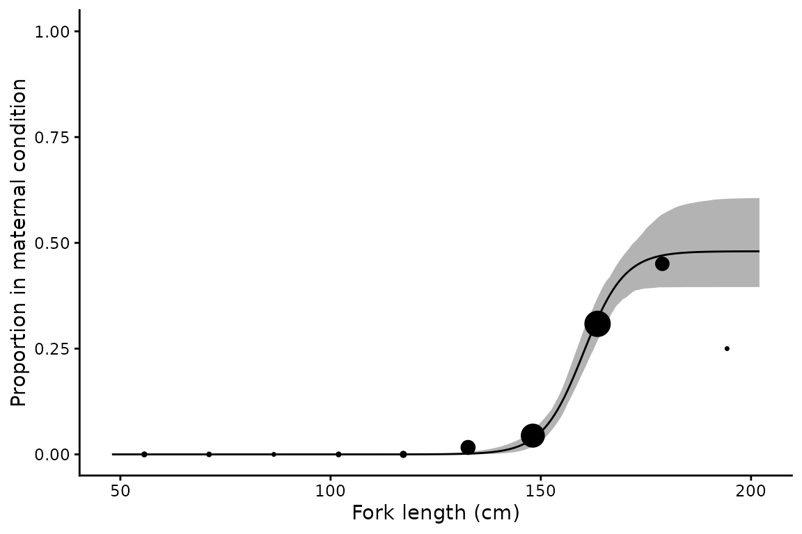
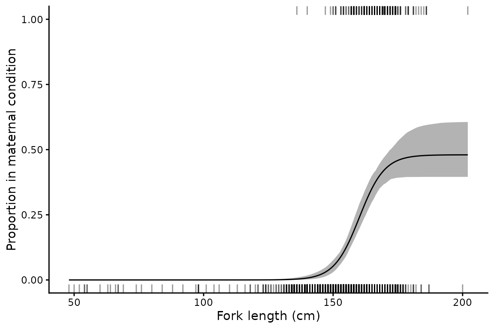
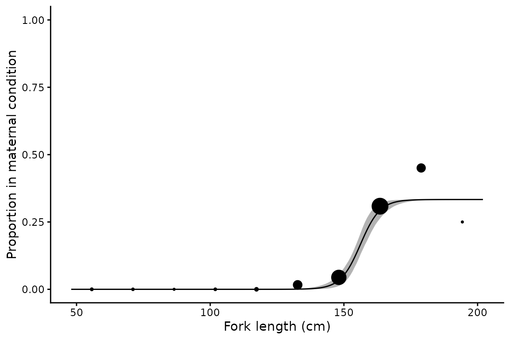
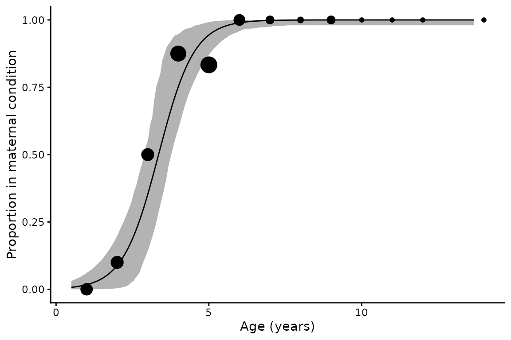

# Length at maternity analysis

## Background

A maturity ogive describes the proportion of females that are sexually
mature at a given length or age. For most teleosts that is sufficient
for calculating reproductive capacity, since mature females spawn every
year. Chondrichthyans differ. Many species reproduce biennially or
triennially, so that in any one year only a fraction of mature females
are gravid, and gestation may run for longer than a year. The quantity a
population model needs is therefore not the proportion mature but the
proportion in *maternal condition*, meaning females that will give birth
or lay eggs by the end of the year and so contribute to recruitment at
the start of the next (Walker 2005).

Walker (2005) modelled this with a three-parameter logistic function
(3PLF) whose upper asymptote is free to sit below one:

``` math
E[Y_i] = P_{Max}\left(1 + e^{-\ln(19)\,(x_i - x_{50}) / (x_{95} - x_{50})}\right)^{-1}
```

Here $`Y_i`$ is a Bernoulli variable indicating whether female $`i`$ is
in maternal condition, $`x_{50}`$ and $`x_{95}`$ are the lengths or ages
at which 50% and 95% of the maximum are maternal, and $`P_{Max}`$ is
that maximum: the proportion of the largest females in maternal
condition in a given year. For an annual cycle $`P_{Max} \approx 1`$,
for a biennial cycle $`P_{Max} \approx 0.5`$, and for a triennial cycle
$`P_{Max} \approx
1/3`$. When $`P_{Max} = 1`$ the model reduces to the ordinary
two-parameter maturity ogive fitted by
[`maturity()`](https://alharry.github.io/mustelus/reference/maturity.md),
and since the parameterisation is shared the two are directly
comparable.

Harry et al. (2024) compared two ways of using this model. In the
*3PLF-fixed* approach of Walker (2005), $`P_{Max}`$ is chosen from
knowledge of the ovarian and uterine cycles and only $`x_{50}`$ and
$`x_{95}`$ are estimated. In the *3PLF-estimated* approach, $`P_{Max}`$
is estimated along with the other parameters. Simulation showed that
estimating $`P_{Max}`$ is feasible, often improves accuracy and interval
coverage relative to a fixed value, and allows reproductive periodicity
to be inferred from the data rather than assumed. The cost is sample
size: 100–200 maternal females were typically needed for accurate
estimation.

[`maternity()`](https://alharry.github.io/mustelus/reference/maternity.md)
implements both approaches. The model is written in `RTMB` and fitted by
maximum likelihood, with bootstrap confidence intervals.

## The data

The example data are the empirical case study from Harry et al. (2024):
maturity and maternity at length for female sandbar sharks,
*Carcharhinus plumbeus*, from the Gulf of Mexico and western North
Atlantic. It combines the reproductive studies of Baremore and Hale
(2012) and Piercy et al. (2016), with maternal condition assigned to
each individual.

``` r

library(mustelus)
data(sandbar)

str(sandbar)
#> 'data.frame':    1087 obs. of  4 variables:
#>  $ FL             : num  145 146 149 182 148 151 132 168 160 155 ...
#>  $ maturity_stage : int  1 0 0 0 1 1 0 1 0 1 ...
#>  $ maternity_stage: int  0 0 0 0 0 1 0 0 0 0 ...
#>  $ source         : chr  "Baremore" "Baremore" "Baremore" "Baremore" ...
```

``` r

c(
  females  = nrow(sandbar),
  mature   = sum(sandbar$maturity_stage, na.rm = TRUE),
  maternal = sum(sandbar$maternity_stage)
)
#>  females   mature maternal 
#>     1087      640      206
```

Fork length is in centimetres. Note that maternal condition is recorded
for every female, while `maturity_stage` has a small number of missing
values.

## Basic usage

By default $`P_{Max}`$ is estimated from the data:

``` r

mt <- maternity(maternity_stage, FL, data = sandbar, times = 500)
summary(mt)
#> # A tibble: 1 × 15
#>   method      m50 m50_lower m50_upper   m95 m95_lower m95_upper  pmax pmax_lower
#>   <chr>     <dbl>     <dbl>     <dbl> <dbl>     <dbl>     <dbl> <dbl>      <dbl>
#> 1 3PLF-est…  160.      157.       164  174.      168.      183. 0.480      0.396
#> # ℹ 6 more variables: pmax_upper <dbl>, n <int>, N <int>, nll <dbl>, AIC <dbl>,
#> #   convergence <lgl>
```

The summary reports the three parameters with bootstrap 95% confidence
intervals, the number of females (`n`) and the number in maternal
condition (`N`), the negative log-likelihood and AIC, and whether the
optimiser converged with a positive-definite Hessian.

$`P_{Max}`$ is estimated at 0.48 (0.4–0.61), so roughly half of the
largest females are in maternal condition in any year. That is what a
biennial cycle looks like. Half of $`P_{Max}`$ is reached at 160.1 cm.

## Plotting

[`plot()`](https://rdrr.io/r/graphics/plot.default.html) returns a
ggplot object. The default shows binned observed proportions scaled by
sample size, with the fitted curve and a bootstrap 95% confidence
ribbon:

``` r

plot(mt) + xlab("Fork length (cm)") + ylab("Proportion in maternal condition")
```



The curve levels off well short of one, which is the whole point of the
third parameter. A two-parameter ogive forced through an asymptote of
one could not describe these data.

The same `raw_data` options as
[`maturity()`](https://alharry.github.io/mustelus/reference/maturity.md)
are available: `"proportions"`, `"point"`, `"rug"`, `"bootstrap"` (a
subsample of the resampled curves in place of the ribbon) and `"none"`.

``` r

plot(mt, raw_data = "rug") + xlab("Fork length (cm)") + ylab("Proportion in maternal condition")
```



## Fixing the asymptote and testing reproductive periodicity

Supplying `pmax` fixes the asymptote and estimates only $`x_{50}`$ and
$`x_{95}`$. This is appropriate when the reproductive cycle is known
from other evidence, and it is the only workable option when maternal
females are too few to estimate $`P_{Max}`$. It also provides a way of
testing competing hypotheses about periodicity: fit the model under each
and compare AIC.

Reproductive periodicity in sandbar sharks has been reported as biennial
by some studies and as longer by others, so both are worth fitting:

``` r

mt_biennial  <- maternity(maternity_stage, FL, data = sandbar, pmax = 0.5, times = 500)
mt_triennial <- maternity(maternity_stage, FL, data = sandbar, pmax = 1/3, times = 500)

fits <- rbind(summary(mt), summary(mt_biennial), summary(mt_triennial))
fits$model <- c("3PLF-estimated", "3PLF-fixed, biennial", "3PLF-fixed, triennial")
fits$dAIC  <- round(fits$AIC - min(fits$AIC), 2)

fits[, c("model", "m50", "m95", "pmax", "AIC", "dAIC")]
#> # A tibble: 3 × 6
#>   model                   m50   m95  pmax   AIC  dAIC
#>   <chr>                 <dbl> <dbl> <dbl> <dbl> <dbl>
#> 1 3PLF-estimated         160.  174. 0.480  836.   1.9
#> 2 3PLF-fixed, biennial   161.  176. 0.5    834.   0  
#> 3 3PLF-fixed, triennial  156.  167  0.333  848.  14.2
```

A biennial cycle is strongly supported over a triennial one, by 14.2 AIC
units. The fixed biennial model also edges out the estimated model by
1.9 units, but since it has one fewer estimated parameter the two have
essentially the same support given the data. This reproduces the result
reported by Harry et al. (2024).

The estimated model is doing useful work even where a fixed model fits
equally well, because the confidence interval on $`P_{Max}`$ shows what
the data can and cannot resolve. Here it excludes 1/3 but comfortably
includes 0.5.

``` r

plot(mt_triennial) + xlab("Fork length (cm)") + ylab("Proportion in maternal condition")
```



Forcing the asymptote down to 1/3 pulls the curve below the observed
proportions at large sizes, which is the source of the AIC penalty.

## Comparison with maturity

Both variables are recorded for these sharks, so the maturity and
maternity ogives can be fitted to the same animals and compared
directly. The parameterisations match, so $`L_{50}`$ and $`x_{50}`$ mean
the same thing on the same scale:

``` r

mat <- maturity(maturity_stage, FL, data = sandbar, times = 500)

data.frame(
  ogive = c("Maturity", "Maternity"),
  x50   = c(summary(mat)$L50, summary(mt)$m50),
  x95   = c(summary(mat)$L95, summary(mt)$m95),
  n     = c(summary(mat)$n,   summary(mt)$n)
)
#>       ogive   x50   x95    n
#> 1  Maturity 151.3 168.0 1065
#> 2 Maternity 160.1 174.4 1087
```

Half of females are mature at 151.3 cm but half of the maternal maximum
is not reached until 160.1 cm, so the maternity curve sits to the right
of the maturity curve as well as below it. Harry et al. (2024) note that
$`L_{50}`$ effectively provides a lower bound for $`x_{50}`$, which is a
useful check on a fit and a source of prior information where maternal
data are sparse.

This comparison also shows what is lost by substituting one for the
other. Using the maturity ogive in place of the maternity ogive would
credit every mature female with annual reproduction, overstating
reproductive output by roughly a factor of two here, and would place the
onset of reproduction some 9 cm too early.

## Using age as the predictor

Any continuous predictor can be used. The sandbar data contain no ages,
but `spottail` does:

``` r

data(spottail)

mt_age <- maternity(maternity_stage, age_agree, data = spottail, times = 500)
summary(mt_age)[, c("m50", "m50_lower", "m50_upper", "m95", "pmax", "n", "N")]
#> # A tibble: 1 × 7
#>     m50 m50_lower m50_upper   m95  pmax     n     N
#>   <dbl>     <dbl>     <dbl> <dbl> <dbl> <int> <int>
#> 1  3.36      2.89      3.78  5.07     1    85    57
```

``` r

plot(mt_age, binwidth = 1) + xlab("Age (years)") + ylab("Proportion in maternal condition")
```



Spot-tail sharks reproduce annually, so $`P_{Max}`$ is estimated close
to one and the maternity curve is nearly the same as a maturity ogive.

## Sample size

Harry et al. (2024) found that estimating $`P_{Max}`$ accurately
generally required 100–200 maternal females. The sandbar data contain
206, which is why the interval on $`P_{Max}`$ above is reasonably tight.
With smaller samples the estimate becomes unstable, and the bootstrap
will report replicates that failed to converge or contained no maternal
females.

Where maternal data are sparse, fixing `pmax` from independent evidence
on the ovarian and uterine cycles is the more defensible choice. The AIC
comparison above is then the way to check that the chosen value is at
least consistent with the data.

## Output structure

The result is a one row tibble with list columns. `mods` holds the
`RTMB` objective function, the `nlminb` result, and the `sdreport`,
which gives asymptotic standard errors as an alternative to the
bootstrap:

``` r

summary(mt$mods[[1]]$sdreport, "fixed")
#>         Estimate Std. Error
#> m50  160.1332890 1.64364813
#> m95  174.4099208 3.58536832
#> pmax   0.4800549 0.05084888
```

``` r

# Bootstrap parameter estimates, one row per replicate
head(mt$boot_coefs[[1]])
#>        m50      m95      pmax
#> 1 159.2499 172.4716 0.4642783
#> 2 161.0113 176.1331 0.5127472
#> 3 162.2913 176.3678 0.5852862
#> 4 161.9157 178.5714 0.5409618
#> 5 158.6454 170.1597 0.4268599
#> 6 161.0868 177.4966 0.5451289
```

## References

Baremore, I.E. and Hale, L.F. (2012) Reproduction of the sandbar shark
in the western North Atlantic Ocean and Gulf of Mexico. *Marine and
Coastal Fisheries* **4**(1), 560–572.
[doi:10.1080/19425120.2012.700904](https://doi.org/10.1080/19425120.2012.700904)

Harry, A.V., Baremore, I.E. and Piercy, A.N. (2024) Quantifying maternal
reproductive output of chondrichthyan fishes. *Canadian Journal of
Fisheries and Aquatic Sciences* **81**(10), 1481–1494.
[doi:10.1139/cjfas-2024-0031](https://doi.org/10.1139/cjfas-2024-0031)

Piercy, A.N., Murie, D.J. and Gelsleichter, J.J. (2016) Histological and
morphological aspects of reproduction in the sandbar shark *Carcharhinus
plumbeus* in the U.S. south-eastern Atlantic Ocean and Gulf of Mexico.
*Journal of Fish Biology* **88**(5), 1708–1730.
[doi:10.1111/jfb.12945](https://doi.org/10.1111/jfb.12945)

Walker, T.I. (2005) Reproduction in fisheries science. In: Hamlett, W.C.
(ed) *Reproductive Biology and Phylogeny of Chondrichthyes: Sharks,
Batoids and Chimaeras*. Science Publishers, Enfield, NH, pp. 81–127.
